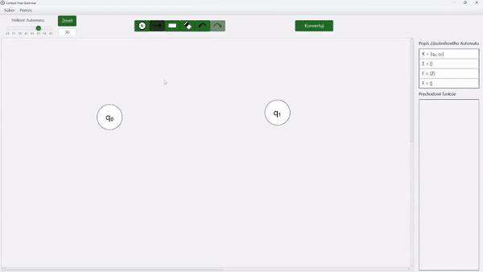
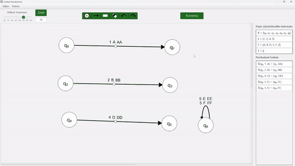

# PDAtoCFG

PDAtoCFG je didaktická, desktopová aplikácia vytvorená ako súčasť bakalárskej práce na tému "Konštrukcia bezkontextovej gramatiky ekvivalentnej so zásobníkovým automatom akceptujúcim prázdnym zásobníkom". Aplikácia je navrhnutá tak, aby pomáhala študentom lepšie pochopiť a naučiť sa robiť prevod zo zásobníkového automatu na bezkontextovú gramatiku.

## Funkcie
- **Interaktívny zásobníkový automat:** Aplikácia obsahuje používateľskú interakciu pri vytváraní automatu.
- **Konverzia automatu na gramatiku:** Hlavnou náplňou aplikácie je náučne ukázať pouźívateľovi, ako taká konverzia prechádza pomocou niekoľkých krokov.
- **Ukladanie súborov:** Používateľ si môže stav aplikácie alebo pravidlá gramatiky uložiť do súboru.

## Inštalácia
Link na stiahnutie aplikácie je k dispozícii [tu](https://github.com/PeterCerven/PDAtoCFG/releases/tag/v1.0).
Aplikáciu PDAtoCFG je možné nainštalovať pomocou priloženého inštalačného súboru `PDAtoCFG.exe` ak je na operačnom systéme windows alebo môže použiť "Jar file", ak má nainštalovanú verziu [javy 19 a vyššiu](https://www.java.com/download/ie_manual.jsp). Tiež je potrebné mať naištalovanú rovankú verziu [JavaFX](https://openjfx.io/).
Pre spustenie "Jar aplikácie" je nutné napísať príkaz v konzole:

```bash
java --module-path JAVAFX_PATH --add-modules javafx.controls,javafx.fxml -jar JAR_FILE_PATH 
```

## Ako používať
Aplikácie obsahuje v lište: __menu -> pomoc -> ovládanie__ používateľskú príručku. Používateľovi sa otvorí okno, kde bude demonštrované použitie a funkcie aplikácie. Aplikácia tiež disponuje niekoľkými klávesovými skratkami a funkciami po kliknutí myšou, ktoré uľahčujú použivanie aplikácie.
- __pravé tlačidlo myši__ zruší výber módu tlačidla späť na mód "SELECT"
- __ctrl + Z spraví__ operáciu "späť".
- __ctrl + shift + Z__ operácia "vráť späť".
- __esc__ zruší výber módu tlačidla späť na mód "SELECT" alebo ak už mód "SELECT" bol aktivny, inicializuje zatvorenie aplikácie.

<div align="center">
    <h3>Používanie módu stav</h3>
    
    <br><br>
    <h3>Používanie módu prechod</h3>
    
    <br><br>
    <h3>Používanie môdu mazanie</h3>
    
</div>

## Kontakt
Ak máte otázky alebo potrebujete pomoc, neváhajte ma kontaktovať na peter.cerven33@gmail.com.
